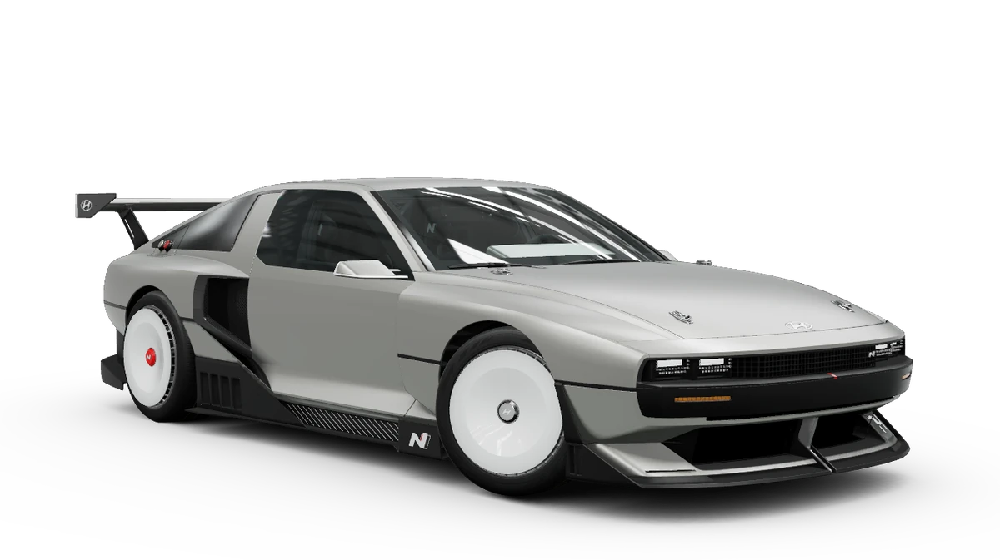

<h1 align="center">N-Vision-74</h1>


<h3 align="center">A 1:10 scale, fabrication-oriented CAD project that translates the Hyundai N Vision 74 concept car into a 3D-printable model.</h3>


<p align="center">
  
</p>

## Overview

- **Scale**: 1:10 (0.1× linear dimensions of the original concept)
- **Design approach**: Assembly-driven SolidWorks structure, clean separation of design geometry (`.SLDPRT`/`.SLDASM`) from fabrication outputs (STL/3MF/STEP)
- **Print constraints**: 2–3mm minimum wall thickness, part segmentation for FDM build volumes, tolerances and assembly features (pins/tabs) built directly into CAD
- **Documentation**: Zensical-based site under `instructions/`, with interactive 3D previews of exported STL components

## Repository Structure

```sh
N-Vision-74/
├── 01_Blueprints/                    # Reference blueprints (side/top/front/rear, multiple resolutions)
├── 02_Reference_Dimensions/          # Real vehicle dimensions and 1:10 scale calculations
├── 03_SolidWorks_Project/            # CAD source files (assembly-driven file plan)
├── 04_Documentation/                 # Build guide chapters (01–10)
├── 05_Checklists/                    # CAD, printability, and material decision checklists
├── 06_Resources/                     # Reference notes and online resources
├── 07_STL_Exports/                   # Exported STL/3MF/STEP files for slicing
├── 08_Print_Iterations/              # Test print logs and revision notes
├── 09_Printer_and_Material_Profiles/ # Printer/material profiles (Bambu P1S, A1 mini)
├── instructions/                     # Zensical documentation project (primary docs site)
├── assets/                           # Reference images and renders
└── requirements.txt                  # Python dependencies (Zensical)
```

Each numbered folder mirrors a chapter in the documentation site — see `instructions/docs/index.md` for the full, linked table of contents.

## Getting Started

```bash
git clone https://github.com/CagriCatik/N-Vision-74.git
cd N-Vision-74

python -m venv venv
.\venv\Scripts\activate      # macOS/Linux: source venv/bin/activate
pip install -r requirements.txt

cd instructions
zensical serve --dev-addr localhost:8000 --open
```

This starts the documentation site at `http://localhost:8000` — full build guide, checklists, printer profiles, and interactive 3D STL previews.

To work on the CAD itself, open `03_SolidWorks_Project/Vehicle_1_10_Master.SLDASM` in SolidWorks 2021+.

**Requirements**: SolidWorks (CAD), Python 3.8+ (docs server), a slicer (PrusaSlicer/Cura) for printing.

## Naming Convention

```
[Number]_[Component_Name].SLDPRT          # Initial version
[Number]_[Component_Name]_R02.SLDPRT      # Revision
[Number]_[Component_Name]_R02.stl         # Matching STL export
```

## Status

Phase 1 (design foundation) in progress: reference sketches and base assembly are in place; primary body surfacing is ongoing. Full roadmap and progress notes live in `04_Documentation/`.

## License

Specify your project license here (e.g., MIT, CC-BY-4.0).

---

Based on the [SolidWorks CAD Tutorial series](https://www.youtube.com/watch?v=qYp9NtI7Ol8&list=PLrXLIrXkHxeolVexRLXKaV8sT8K6MMKDX&index=2).
