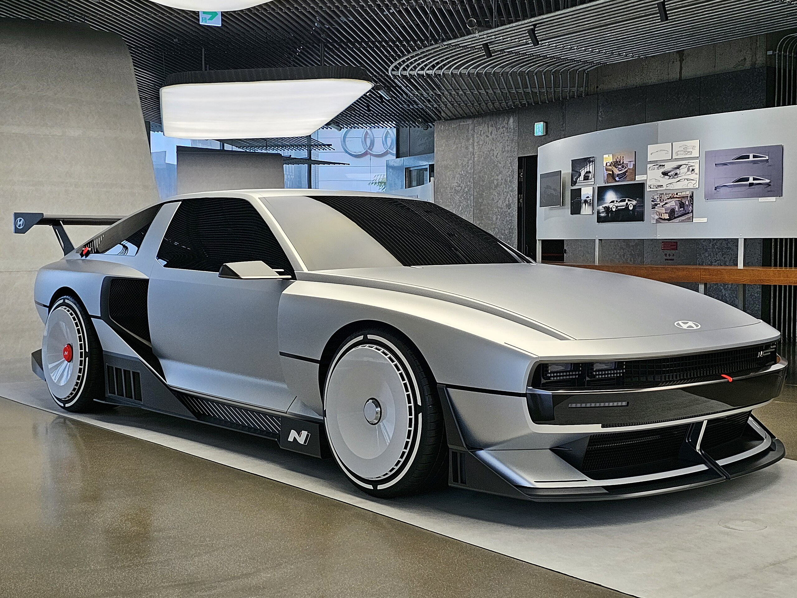

# N-Vision-74

A repository for modeling, scaling, and preparing a 1:10 physical model of the Hyundai N Vision 74 concept car for fabrication (e.g. 3D printing), based on the linked SolidWorks tutorial series.

## Preview

<p align="center">
  
</p>

---

## Project Goals

- Recreate the exterior of the Hyundai N Vision 74 concept as a 1:10 scale CAD model.  
- Practice advanced surfacing and parametric modeling with a fabrication-oriented workflow.  
- Maintain a clean separation between design geometry (CAD) and fabrication outputs (STL, STEP, etc.).  
- Document scale, tolerances, and print-specific modifications for reproducible results.  

---

## Scale And Printing Context

Target scale:

- Original vehicle: 1:1  
- Model: 1:10  
- Scale factor: 0.1 (all linear dimensions)

Key considerations for a 1:10 printable model:

- Minimum wall thickness and feature size compatible with your printer and nozzle.  
- Reasonable part segmentation for printing and post-processing (e.g. body split into front / rear / roof modules).  
- Alignment and assembly features (pins, tabs, overlaps) included directly in CAD.  
- Optional clearance offsets for press-fit or glue joints.  

---

## Repository Structure

This structure is oriented around both CAD work and fabrication preparation.

```text
.
├─ assets/                 # Reference images, renders, and screenshots
├─ blueprints/             # Blueprints in different colors and resolutions
├─ cad/                    # Native CAD files (parts, assemblies, surfaces)
│  ├─ parts/               # Individual components at 1:10 scale
│  ├─ assemblies/          # Main and sub-assemblies (print and display)
│  └─ surfaces/            # Surface bodies and construction geometry
├─ print/                  # Files prepared for fabrication (export)
│  ├─ stl/                 # Triangulated meshes for 3D printing
│  ├─ step/                # Neutral CAD for external tools or CNC
│  └─ configs/             # Slicer profiles, notes, and print presets
├─ docs/                   # Notes, sketches, dimension and scale references
└─ README.md
```

Adapt folder names and paths to match the actual repository state.

---

## Software And Requirements

- CAD software: SolidWorks (version according to your local setup)
- 3D printing workflow:

  - Slicer software (e.g. PrusaSlicer, Cura, SuperSlicer, etc.)
  - 3D printer capable of the chosen build volume and nozzle size
- Optional:

  - Image viewer / editor for preparing and aligning reference images
  - Mesh inspection tool (e.g. Meshmixer, Netfabb, or similar) for STL checks

---

## How To Use This Repository

1. Clone the repository:

   ```bash
   git clone https://github.com/CagriCatik/N-Vision-74.git
   cd N-Vision-74
   ```

2. Open the relevant SolidWorks assembly or starting part from `cad/assemblies/`.

3. Verify or apply the 1:10 scale:

   - Keep a master configuration at 1:1 if desired.
   - Create a 1:10 configuration or a scaled derivative assembly.
   - Document the chosen scaling method in `docs/scale-notes.md` (or similar).

4. Prepare the printable segmentation:

   - Define logical cuts for body, roof, bumpers, wheels, and interior (if present).
   - Add alignment pins, sockets, or glue flanges in CAD.
   - Check that each segment fits the build volume of the target printer.

5. Export fabrication files:

   - Export STLs to `print/stl/` with clear naming (e.g. `NV74_body_front_1-10.stl`).
   - Optionally export STEP/IGES to `print/step/` for external processing.

6. Document print parameters:

   - Store slicer profiles and key settings in `print/configs/`.
   - Record print orientation, supports, infill, and material choices in `docs/printing-notes.md` or equivalent.

7. Update documentation as the project evolves:

   - Add milestone screenshots to `assets/`.
   - Capture dimension decisions, scale checks, and tolerance experiments in `docs/`.

---

## Modeling And Printing Notes

Use this section as a technical log during development.

### Scale And Key Dimensions

- Target scale: 1:10
- Wheelbase (real vs model):
- Track width (real vs model):
- Overall length, width, height (real vs model):
- Any intentional deviations from perfect 1:10 (e.g. thickened pillars, exaggerated fillets) for printability.

### Reference Planes And Sketching Strategy

- Primary reference planes for car centerline, ground plane, and wheel centers.
- Pattern of sketches (side, top, front) used to control character lines and volumes.
- Method for aligning reference images or blueprints in SolidWorks.

### Surfacing Strategy

- Main body shell surfaces.
- Separation of hood, roof, doors, bumpers, and side skirts.
- Treatment of sharp edges, chamfers, and fillets to survive the scaling and meshing process.

### Print-Oriented Design Decisions

- Minimum wall thickness and target shell thickness.
- Clearance between mating parts (e.g. pins and holes).
- Support-friendly design choices (overhang angles, integrated support ribs that can be sanded).
- Known weak spots and reinforcement features.

---

## Roadmap

Design and modeling:

- Set up reference images and base sketches at full scale.
- Define main volumes and character lines for the body.
- Complete primary surfacing and ensure curvature continuity where needed.
- Add details: wheel arches, wheels, lights, grills, vents, mirrors, and trims.

Scale and fabrication:

- Finalize 1:10 configuration and validate key dimensions.
- Segment the model for printing (body modules, wheels, optional interior).
- Integrate assembly features (pins, sockets, flanges) for reliable alignment.
- Export and verify STLs (manifold checks, normals, mesh quality).
- Test prints of sample parts to validate tolerances and scale.
- Iterate based on print results, then produce the full model.

Presentation:

- Create simple render scenes for documentation.
- Photograph or document the printed and assembled model.
- Update `assets/` and `docs/` with final results and lessons learned.

---

## Reference Tutorial

This project is based on or inspired by the following playlist - [Tutorials for Modeling - SolidWorks](https://www.youtube.com/watch?v=qYp9NtI7Ol8&list=PLrXLIrXkHxeolVexRLXKaV8sT8K6MMKDX&index=2)

